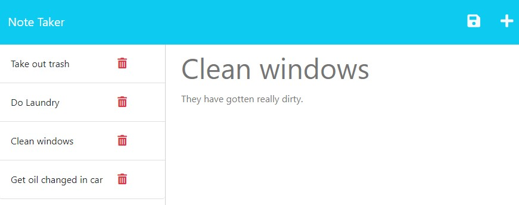

# No~~d~~e Taker

## Description

The node based notetaking app!

It can be used to keep track of chores, todos at work, or make small notes for the future!

## Usage

Go to [the deployed application](https://nodetaker.herokuapp.com). You can create new notes with the ➕ button. Once you have filled out the name and description of the note, you can click the 💾 in the top left.

All your notes will be on the left side of the screen. You can click 🗑️ to delete notes.

## License

This project is licensed under The MIT License.

## Questions

My github: [SprocketCreations](https://github.com/sprocketcreations)

